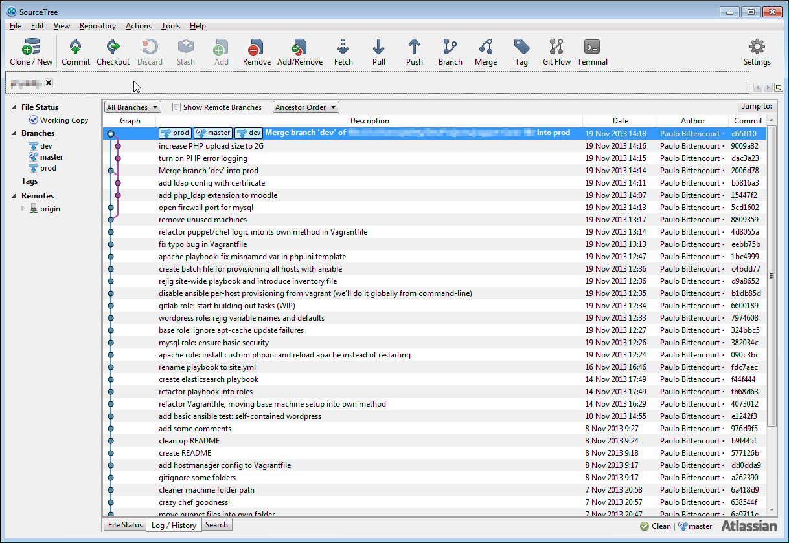
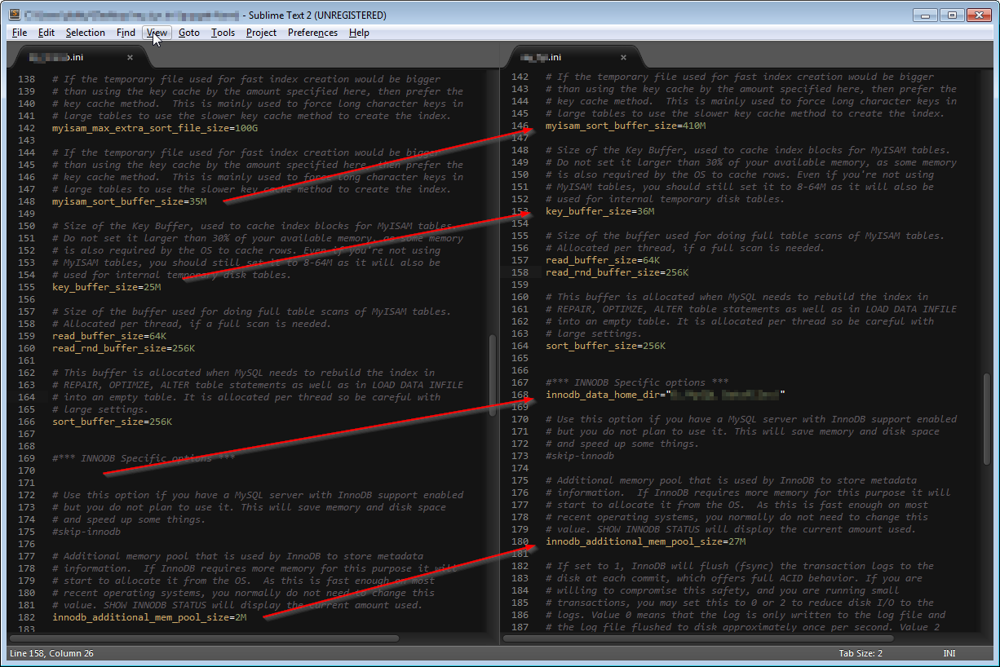
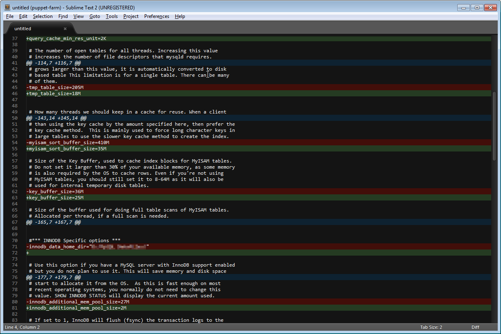
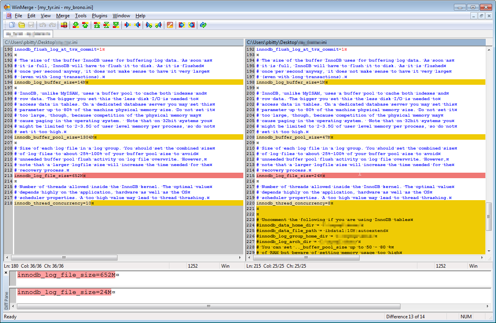

# Infrastructure<br/>as Code


*Building and managing our infrastructure programatically*


## Motivation & Context

<ul>
  <li class="fragment roll-in">
    parts of our web services infrastructure are outdated<br/>
    and in need of an overhaul<br/>
    <br/>
  </li>
  <li class="fragment roll-in">
    on the operations side, there are awesome things going on,<br/>
    like SCCM, image builds, and the infrastructure is solid<br/>
    <br/>
  </li>
  <li class="fragment roll-in">
    web services side has some needs that are not met by the current setup<br/>
    <br/>
  </li>
  <li class="fragment roll-in">
    we have made plans to start building some Linux environments<br/>
    for web application hosting<br/>
    <br/>
  </li>
  <li class="fragment roll-in">
    this incurs a new kind of management overhead, beyond the<br/>
    management of the Windows infrastructure<br/>
    <br/>
  </li>
  <li class="fragment roll-in">
    the concepts and tools shown here serve to avoid just that<br/>
    but also bring with them several benefits over time<br/>
    <br/>
  </li>
</ul>


## Disclaimer

None of what is mentioned here is meant to be  
implemented  as-is, or all-at-once.

These are just concepts and building blocks that we can use.


It is generally better to start small and simple.

Build out slowly as needed.


*some definitions*


Infrastructure
---------------
The organization of systems that are needed  
for providing IT services.  


### Things like  

* network
* VM hosts
* VM instances
* server software
* applications
* cron jobs
* monitoring systems
* backup systems
* *blah blah blah...*


Code
----
Text-based information, usually written by humans, that serves as instructions for a computer, defining its operation and behavior.


### Things like
* scripts
* config files
* application source


## Infrastructure as ... Code?


*A collection of scripts? for each of our servers?*

Not exactly.<br/><br/>

*So what then?*


Using a dedicated language to model server configuration,  
and the collective system as a whole.


## Why is it awesome?
<br/><br/>
*"Building and managing your infrastructure ..."*

This part we already have.


*"... programmatically!"*
<br/><br/>
This is what makes it awesome.  

We have a lot of this already with SCCM.


###How does that make it awesome?

By bringing to the infrastructure level many advantages 
that were previously only available to developers,  
working with source code.


## Like what?
<br/>

* modularity
* composability
* transparency
* versioning
* reduced duplication
* ease of testing
* ease of collaboration
* *more, MORE, MORE!!*


*All that? How?*
<br/><br/>
Thanks to **three** important aspects.


### Abstraction
### Automation
### Text


Abstraction
-----------
*Putting complicated stuff behind a simple facade*  


Higher levels of abstraction enable higher levels of reasoning,  
enabling higher levels of creativity and innovation.  
<br/>
We can scale higher and higher levels of complexity  
down to our limited brain capacity.


Automation
-----------
*Letting the computer do things for you*


*This brings good things*
<br/><br/>

* higher efficiency - raw speed of executing tasks
* consistent repeatability, allowing:
  * reduced error rates
  * easier investigation
  * testing
  * experimentation


Automation is actually a form of abstraction, hiding the complexity of many tasks under one automated task.
<br/><br/>
*"do A, then B, then C, then D, then E, then F, then maybe G or H"*  
becomes  
*"press button (go get coffee)"*


Computing history consists of decades of  
abstractions built upon abstractions.  


*Like programming languages...*


### Assembly
``` assembly
        .section        .rodata
string:
        .ascii "Hello, world!\n"
length:
        .quad . -string         #Dot = 'here'
 
        .section        .text
        .globl _start           #Make entry point visible to linker
_start:
        movq $4, %rax           #4=write
        movq $1, %rbx           #1=stdout
        movq $string, %rcx
        movq length, %rdx
        int $0x80               #Call Operating System
        movq %rax, %rbx         #Make program return syscall exit status
        movq $1, %rax           #1=exit
        int $0x80               #Call System Again
```


### C
``` C
#include <stdio.h>
#include <stdlib.h>
 
int main(void)
{
    printf("Hello, world!\n");
    return EXIT_SUCCESS;
}
```

### C++
``` C++
#include <iostream>
 
int main()
{
    std::cout << "Hello, world!" << std::endl;
    return 0;
}
```


Java
``` Java
public class HelloWorld {
   public static void main(String[] args) {
       System.out.println("Hello, world!");
   }
}
```

Javascript
``` Javascript
console.log('Hello, world!');
```

Python
``` Python
print("Hello, world!")
```

Ruby
``` Ruby
puts "Hello, world!"
```

PHP
``` PHP
<?php echo 'Hello, world!' ?>
```


*and program/data storage*


## punch cards
* completely manual
* physical loading, unloading, editing, sequencing


## tape
* manual loading
* automatic seek, read, write


## hard disk
* completely automatic


## file system
* disk mechanics seamlessly handled
* no need to know which sector/cylinder/block


## file manager GUI / desktop
* graphical abstraction of file organization


## web / cloud
* physical location abstracted away
* where's the data now?  
  *who cares, it's in the National Sec... ahem, cloud.* :)


Text
------
The universal interface.


Some ubiquitous text-based languages & protocols:

* HTTP
* SMTP
* FTP
* HTML
* XML
* JSON
* YAML


All Unix configuration is done via text files.

* User database ```/etc/passwd```
* Cron jobs ```/etc/crontab```
* Apache  ```httpd.conf```
* PHP ```php.ini```


* most compatible data format on earth
* 100% version-control friendly


*where's the damn code already?*


Configuration Management
-------------------------


*Configuration management tools enable*
<br/><br/>

* machine configuration to be managed centrally 
* consistency across machines and environment
* automation of administrative tasks
* higher levels of abstraction for representing IT infrastructure


### Contenders
<br/>

* Chef
* Puppet
* Ansible
* Salt
* CFEngine
* *does this list ever end?*


 
*finally some code ...*


*it all boils down to*

*little pieces  
 building up into  
 bigger pieces...*


***resources*** as the basic unit of data
<br/>

Puppet : ```manifest.pp```
```puppet
user { 'john':
  home => /home/john
  ensure => present
}
```

Chef : ```recipe.rb```
```ruby
user 'paul' do
  home '/home/paul'
  action :create
end
```

Ansible : ```tasks.yml```
```yaml
- task: create sysadmin user
  user: name=george home=/home/george state=present
```


grouped together into logical blocks, like ***modules***

```yaml
- task: clone moodle repository
  git: dest={{ moodle_web_root }} repo=https://github.com/moodle/moodle

- task: configure moodle
  template: src=config.php.j2 dest={{ moodle_web_root }}/config.php
            owner=www-data mode=0400

- task: create moodle database
  mysql_db: name={{ moodle_database_name }} state=present
  delegate_to: '{{ moodle_database_host }}'

- task: create moodle database user
  mysql_user: name={{ moodle_database_user }}
              password={{ moodle_database_password }}
              host={{ inventory_hostname }} priv=moodle.*:all
              state=present
  delegate_to: '{{ moodle_database_host }}'
```


representing individual ***services*** provided by/for a machine
```yaml
# Our Moodle web server group
- hosts: moodle_web

  # Common configuration variables
  vars:
    moodle_database_host: moodledb.example.com
    moodle_database_password: [stored in a protected file]
    moodle_url: https://moodle.example.com/

  # Services on this machine
  roles:
    - base
    - apache
    - moodle # <-- The code from the previous slide is in here!
```


*Remember this list?*
<br/><br/>

* modularity
* composability
* transparency
* versioning
* reduced duplication
* ease of testing
* ease of collaboration
* ...

<br/>
Here is where it finally comes together...


### Modularity

The *services* described earlier are stored as separate __modules__.


#### Example modules:

* mysql database
* apache web server
* apache php module
* moodle
* domain authentication
* backup client
* firewall
* monitoring
* logging


### Composition

*Systems* are __composed__ of combinations of modules.


#### Production land

* database server
  * __domain authentication__
  * __firewall__
  * __backup__
  * __monitoring__
  * *mysql*
<br/><br/>
* web server
  * __domain authentication__
  * __firewall__
  * __backup__
  * __monitoring__
  * *apache*
  * *some_app*


#### Development / Staging land
* database server
  * __domain authentication__
  * __firewall__
  * *mysql*
<br/><br/>
* web server
  * __domain authentication__
  * __firewall__
  * *apache*
  * *some_app*


#### Developer's __local__ VM land
* all-in-one server
  * mysql
  * apache
  * some_app
  * developer/debugging tools


Modules are shared across machines,  
ensuring consistency between environments.
<br/><br/>
*eg. mysql on staging is __identical__ to mysql on production   
(or as close as possible, with differences explicitly stated)*


## Transparency
*minimal digging around for answers*

*one source of truth*

*inherent documentation*

```yaml
- hosts: moodle_db
  vars:
    firewall_ports:
      - { port: 3306, src: 10.0.0.10 }
      - { port: 22, src: 10.0.0.0/24 }
    mysql_query_cache: 100MB
    mysql_buffer_pool: 2GB
  roles:
    - base
    - mysql
```


## Versioning
*extending transparency over time*

*ease of collaboration*

*inherent changelog*





## Repeatability
*all this gives us a good foundation for*

* testing
* experimentation
* troubleshooting
* having fun!
* geekin' out!


*and can open the door for*
<br/><br/>

* incremental, controlled change
* zero-downtime deployments
* scalability / redundancy
* different levels of disaster recovery
* dev/staging/demo environments
* *insert more cool things here*


## Recent scenarios

*where configuration management would have been useful*


### Moodle DB migration
  * manual install of mysql required
  * manual comparison and consolidation of mysql config files
  * recently had to double-check due to doubt of human accuracy











### app server hacked
  * loss of historical/forensic data
    * to get it working again, 'hacked' app was tampered with or destroyed
    * password file changed
    * missed opportunity for learning from the issue
<br/><br/>

  * manual process for setting up new app server
    * took hours to get new server up and running
    * had to manually inspect setup on old server  
      and manually duplicate it


*Enough talk.*

*Time for a demo!*


# Ansible


* no agents
* uses SSH for security/authentication/communication
* uses YAML files and English-like syntax
* low-overhead, very gentle learning curve


Paulo, switch to the demo now.


We must remember to ask ourselves the most important question...


*What would Picard do?*


He would use a Configuration Management tool  
and store the infrastructure as code.


Thank you